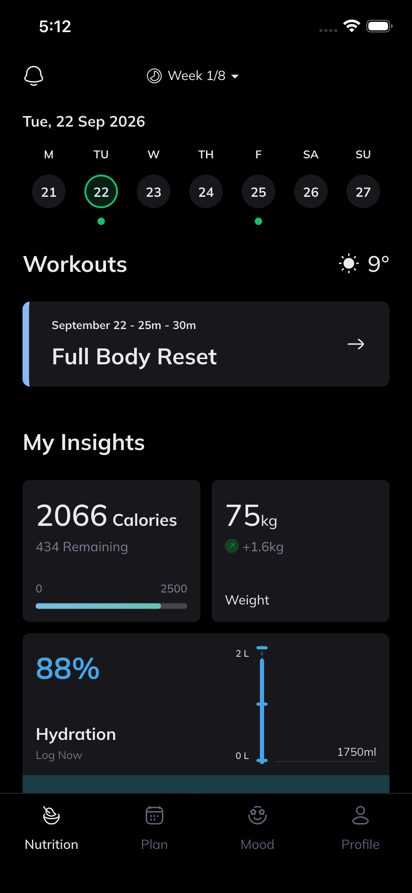
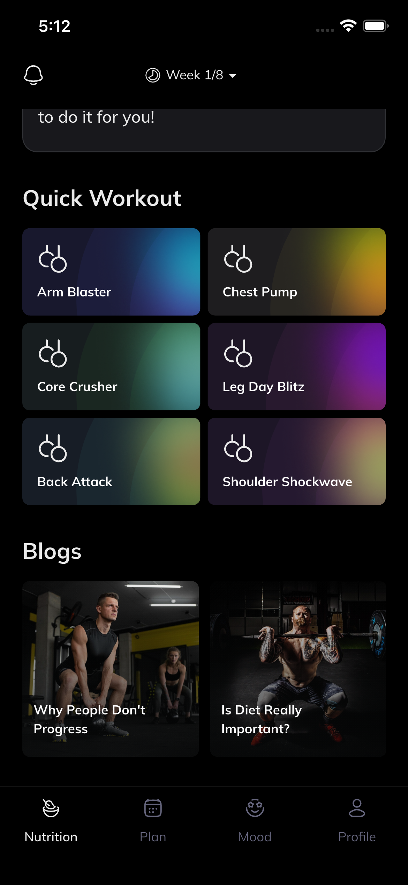
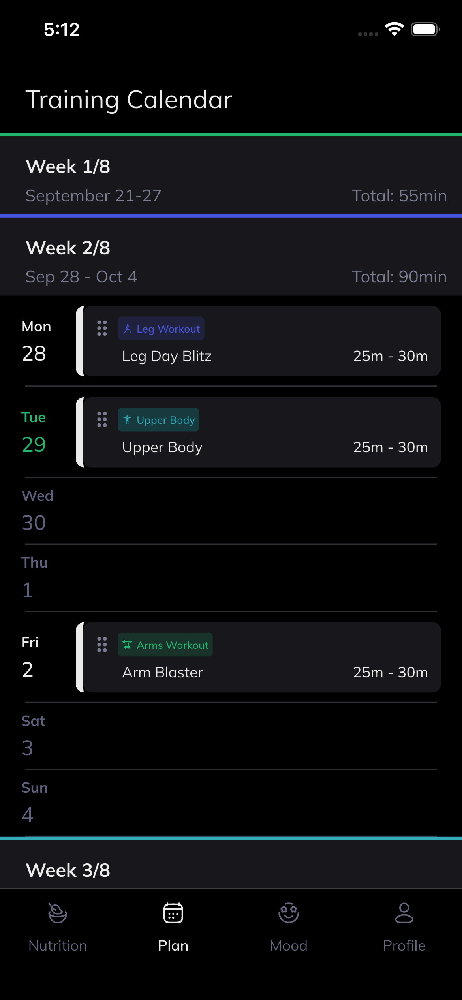
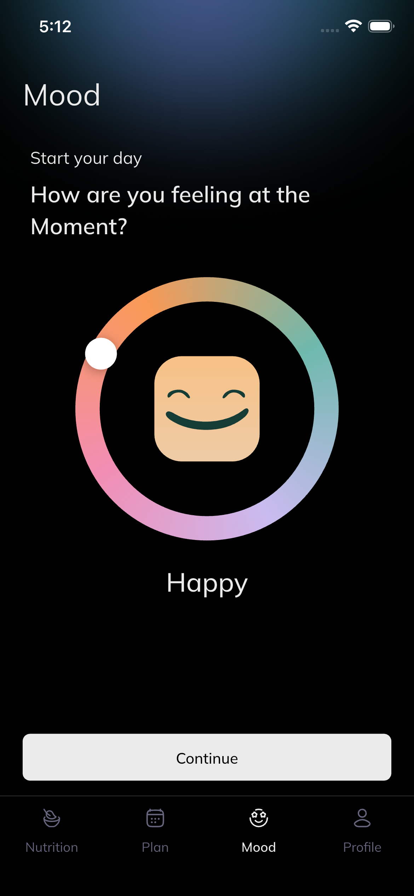
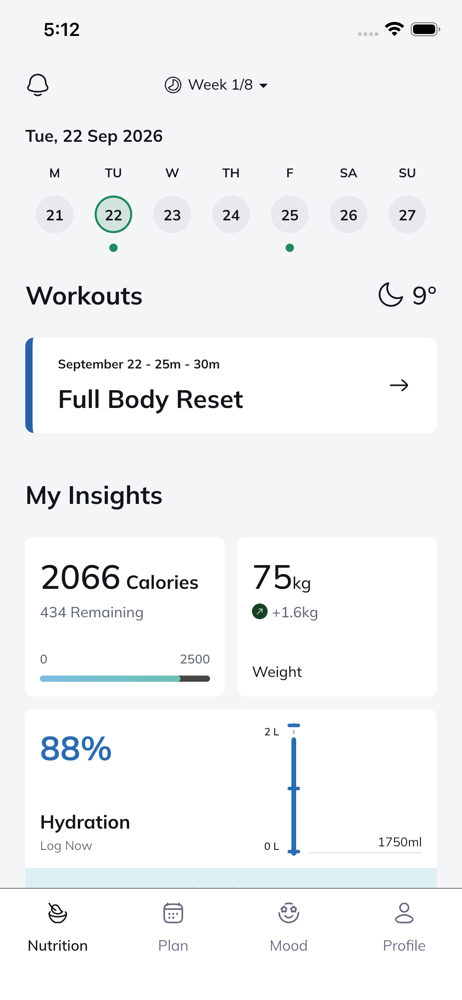
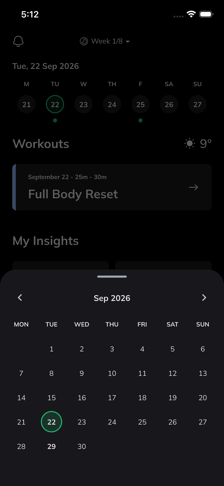
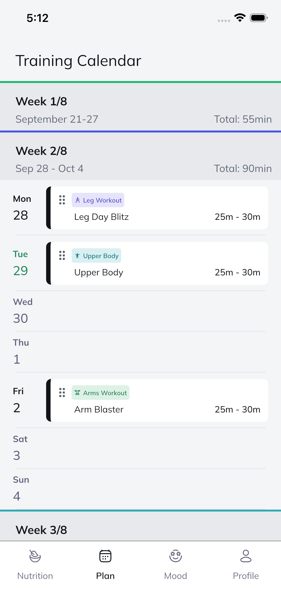
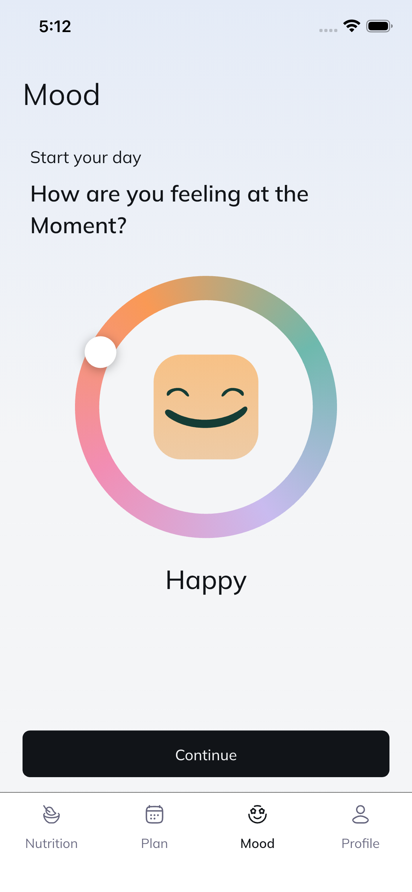

# Evencir — Flutter Interview Test Task

A Flutter fitness/wellness app featuring a home dashboard, mood tracker, training plan calendar, and profile screen.

## Dependencies Used & Why

| Package                                                           | Purpose                                                                                              |
| ----------------------------------------------------------------- | ---------------------------------------------------------------------------------------------------- |
| [provider](https://pub.dev/packages/provider)                     | State management across the app (controllers for home, mood, and schedule screens).                  |
| [shared_preferences](https://pub.dev/packages/shared_preferences) | Lightweight local persistence for storing user preferences (e.g. theme, onboarding state) on-device. |
| [intl](https://pub.dev/packages/intl)                             | Date formatting and localization utilities used throughout the calendar and scheduling features.     |
| [flutter_screenutil](https://pub.dev/packages/flutter_screenutil) | Screen adaptation so UI scales consistently across different device sizes and resolutions.           |
| [flutter_svg](https://pub.dev/packages/flutter_svg)               | Rendering SVG icons and illustrations used in the app's UI.                                          |

## Project Structure

```
lib/
 ├── core/
 │    ├── theme/       # App-wide theming: colors, typography, category styles, and a ThemeController
 │    └── utils/       # Shared utility helpers (e.g. date formatting)
 ├── data/
 │    ├── models/      # Data models (Mood, Workout, TrainingProgram, DailyInsights)
 │    └── repositories/# Repository abstraction (FitnessRepository) with a mock implementation
 ├── features/
 │    ├── home/        # Home dashboard: controller, screen, and its widgets (hydration, insights, week strip, etc.)
 │    ├── mood/        # Mood tracker: controller, screen, and mood wheel/palette widgets
 │    ├── plan/         # Training calendar/schedule: controller, screen, and week/day widgets
 │    ├── profile/     # User profile screen
 │    ├── shell/       # App shell hosting bottom navigation between features
 │    └── widgets/     # Shared reusable widgets (buttons, bottom nav bar, drag handles)
 ├── app.dart          # Root app widget: theme + routing setup
 └── main.dart         # App entry point, initializes SharedPreferences before runApp
```

- **core/**: Cross-cutting concerns (theming, utilities) shared by every feature.
- **data/**: Domain models and the repository layer that supplies data to controllers.
- **features/**: Self-contained feature modules, each with its own controller (state/business logic), screen (UI), and widgets subfolder.

## App Screenshots

| Home | Quick Workouts | Training Plan | Mood |
| --- | --- | --- | --- |
|  |  |  |  |
|  |  |  |  |

## App Video

[Watch App Demo Video](https://drive.google.com/drive/folders/1d5CeQ7A02zH3OSRlAgJpMmF-BziRPuNb?usp=sharing)

## App APK

[Download APK](https://github.com/ayeshakamran543/evencir-fitness/releases/download/v1.0/app-release.apk)
